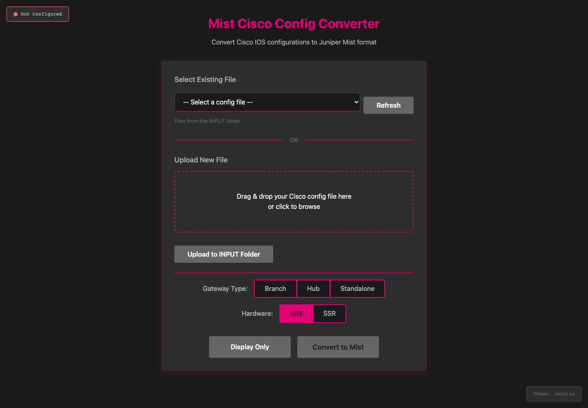
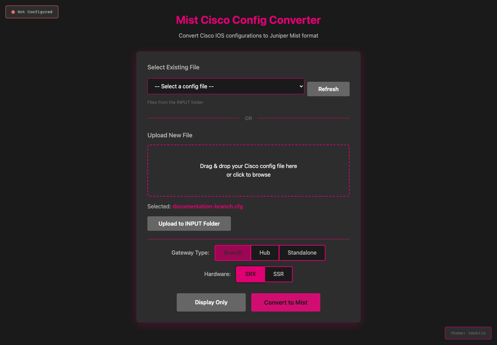
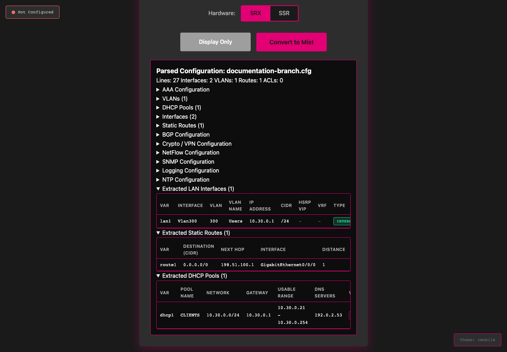
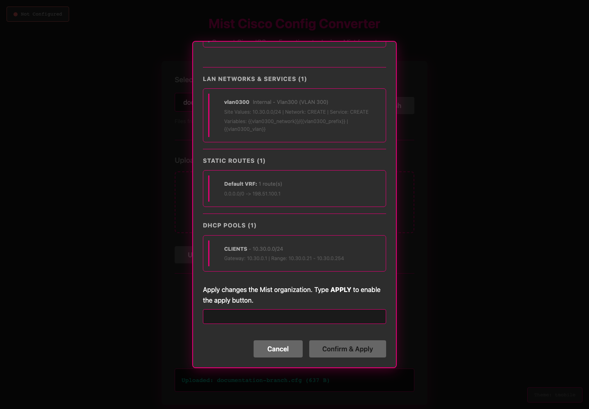

# Mist Cisco Config Converter

## What

A web application that converts Cisco IOS configuration files to Juniper Mist
gateway settings. Review the proposed settings before you apply them.



## How

For local development on macOS or Linux, install Python 3.13 or later.
From the repository directory, run:

```sh
python3.13 -m venv .venv
source .venv/bin/activate
python -m pip install -r requirements.txt
cp .env.example .env
```

Edit `.env` to set `MIST_APITOKEN`, `MIST_HOST`, `org_id`, and a random
`SECRET_KEY`. See the [configuration instructions](docs/USER_GUIDE.md#configuration).
Then start the application:

```sh
python app.py
```

Open <http://localhost:8000>. Use this server for local development only.
See the [detailed setup instructions](docs/USER_GUIDE.md#development) for
Windows and production use, or the [container quick-start](docs/USER_GUIDE.md#quick-start).

Select or upload a Cisco configuration, choose the gateway role and hardware,
then review the conversion. See the [user guide](docs/USER_GUIDE.md) for setup,
configuration, API routes, development, and change history.

These screens show the real application with a sample configuration, not a live
network. See the [interface walkthrough](docs/INTERFACE.md) for capture details.







## Where

Run the application on your own machine or in a container. Open
<http://localhost:8000> for the container web interface. Use the
[Cisco-to-Mist mapping reference](docs/CISCO_TO_MIST_MAPPING.md) to check the
conversion rules.

## When

Use it during migration planning, before you deploy new gateway settings.
Inspect the proposal and confirm the target organization before any apply
operation. The [user guide](docs/USER_GUIDE.md#power-user-mode) explains bulk
operations and their confirmation requirements.

## Why

Reduce manual configuration work while keeping engineers in control of the
review and deployment steps. A preview is not a guarantee of feature parity;
check the [mapping reference](docs/CISCO_TO_MIST_MAPPING.md) and your design.

## Who

For network engineers who migrate Cisco IOS configurations to Juniper Mist.
Maintained in [jmorrison-juniper/MistCiscoConfigConverter](https://github.com/jmorrison-juniper/MistCiscoConfigConverter).
Use [GitHub issues](https://github.com/jmorrison-juniper/MistCiscoConfigConverter/issues)
to report problems. See [LICENSE](LICENSE) for the CC BY-NC 4.0 terms.
